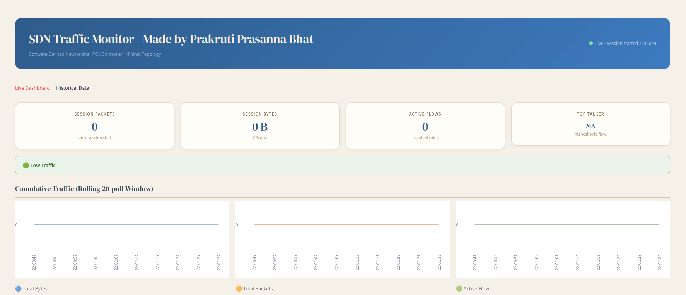
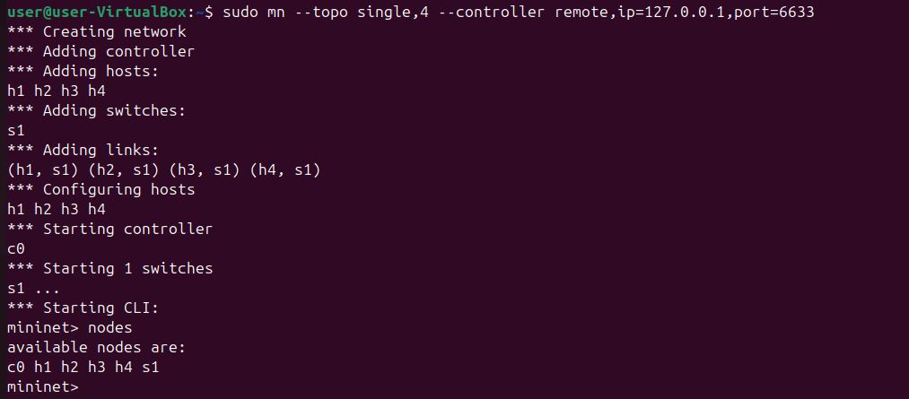

# SDN Traffic Monitoring Dashboard using Mininet and POX


An SDN-based traffic monitoring project built using **Mininet**, **POX controller**, and a **Streamlit dashboard** to demonstrate controller-switch interaction, flow-rule logic, traffic statistics collection, and observable network behavior.

---

##  Problem Statement

The goal of this project is to build a controller module that collects and displays traffic statistics in a Mininet-based SDN environment.

The project demonstrates:

- Controller–switch interaction  
- OpenFlow match–action rule behavior  
- Packet handling through controller logic  
- Traffic monitoring using packet and byte counts  
- Performance observation using ping, iperf, and flow tables  

This project is implemented on an **Ubuntu 24 VM** using Mininet and POX.

---

##  Objectives

- Create a working Mininet topology  
- Connect Mininet to a POX controller  
- Handle `packet_in` events in the controller  
- Install flow rules dynamically  
- Monitor traffic and flow statistics  
- Visualize collected data through a dashboard  
- Demonstrate allowed vs blocked or normal vs failure behavior  

---

##  Features

- SDN controller logic using POX  
- Traffic statistics monitoring  
- Packet count and byte count collection  
- Flow-level logging  
- Dashboard-based visualization  
- Support for traffic observation using `pingall` and `iperf`  
- Proof of execution using flow tables and screenshots  

---

##  Topology Used

This project uses a simple Mininet topology for easy demonstration and observation.

Example setup:
- 1 switch  
- 4 hosts  
- remote POX controller  

This simple topology helps clearly demonstrate forwarding, monitoring, and blocked traffic behavior.

---

##  Project Workflow

1. Hosts send traffic through the Mininet switch  
2. If no matching flow rule exists, the switch sends a `packet_in` event to the controller  
3. The POX controller processes the packet  
4. The controller decides whether to allow, forward, or block traffic  
5. Flow rules are installed in the switch  
6. Traffic statistics are collected and stored  
7. The dashboard reads the stored data and displays traffic behavior  

---

##  Folder Structure

```text
sdn-traffic-monitor/
├── controller/
│   └── traffic_monitor.py
├── dashboard/
│   └── app.py
├── data/
│   ├── flow_log.csv
│   ├── stats.json
│   └── traffic_log.csv
├── images/
├── .gitignore
├── README.md
└── requirements.txt
```

---

##  Data Files

All monitoring outputs are stored in the `data/` folder:

- `flow_log.csv` → flow-level statistics  
- `traffic_log.csv` → traffic trend data  
- `stats.json` → aggregated or latest statistics  

---

##  Requirements

### System Requirements
- Ubuntu 24 VM  
- Python 3  
- Mininet  
- Open vSwitch  
- POX controller  

### Python Packages

Install using:
```bash
pip install -r requirements.txt
```
Packages used:
- streamlit
- pandas
- matplotlib
---
---
## Setup Instructions

### 1. Install Mininet

```bash
sudo apt update
sudo apt install mininet -y
```
Verify installation:
```bash
sudo mn
```
### 2. Install POX Controller
```bash
git clone https://github.com/noxrepo/pox
cd pox
```
Run POX:
```bash
./pox.py log.level --DEBUG
```
## How To Run
### Step 1: Set up terminals
#### Terminal 1
```bash
cd ~/pox
python3 pox.py log.level --DEBUG openflow.of_01 forwarding.traffic_monitor
```
#### Terminal 2
```bash
cd ~/CN-Orange-PES1UG24CS330/sdn-traffic-monitor
source .venv/bin/activate
streamlit run dashboard/app.py
```

#### Terminal 3
```bash
sudo mn -c
sudo mn --topo single,4 --controller remote,ip=127.0.0.1,port=6633
```

----
### Step 2: Verify Controller Connection

Once all terminals are running:

- In **Terminal 1 (POX)**:
  - You should see logs indicating switch connection (`ConnectionUp`)
- In **Terminal 3 (Mininet)**:
  - No controller errors should appear

This confirms that the controller and switch are successfully connected.

---
## Step 3: Test Basic Connectivity

Inside the Mininet CLI (Terminal 3):
```bash
pingall
```
Expected result:
All hosts should successfully communicate (in normal scenario)
Packet loss should be 0% or minimal

---
### Step 4: Generate Traffic

To simulate higher traffic:
```bash
iperf h1 h2
```
What to observe:
- Increased traffic in the Streamlit dashboard
- Higher byte and packet counts
- Logs are updated in real time

---
### Step 5: Observe Dashboard
In Terminal 2 (Streamlit):
Open the provided local URL (usually http://localhost:8501)
Observe:
- Traffic trends 
- Packet counts
- Byte counts
- Flow activity
- Traffic spikes during iperf

---
### Step 6: View Flow Table 
Open a new terminal and run:
```bash
sudo ovs-ofctl dump-flows s1
```
This shows:
- Installed flow rules
- Match–action entries
- Packet/byte counters
---
### Step 7: Demonstrate Test Scenarios
### Scenario 1: Normal Traffic
Run pingall
All hosts communicate successfully
Dashboard shows steady traffic

Scenario 2: High Traffic
Run iperf h1 h2
Observe spike in dashboard graphs
Increased throughput and packet count
❌ Scenario 3: Blocked / Filtered Traffic
Modify controller to block a host (e.g., h3)
Run ping between blocked hosts

Expected:

Communication fails
Packet drops observed
Dashboard shows reduced or no traffic for that flow
Step 8: Stop the System
Stop Mininet:
exit
Stop POX:
Ctrl + C
Stop Streamlit:
Ctrl + C
Notes
Always start the POX controller before Mininet
Run sudo mn -c before restarting topology to avoid conflicts
Ensure virtual environment is activated for dashboard
Demo Tips
Start with pingall → show normal behavior
Run iperf → show spike 📈
Show dashboard + flow table side-by-side
Then demonstrate blocked traffic

This gives a clear and strong demo for evaluation 💯
